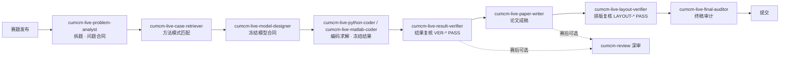

# 乱崎凶华-CUMCM-live-Codex 技能套件


## 目录

- [1. 技能清单](#1-技能清单)
- [2. 工作流](#2-工作流)
- [3. 环境要求](#3-环境要求)
- [4. 在 Codex 中安装技能](#4-在-codex-中安装技能)
- [5. 使用方法与触发示例](#5-使用方法与触发示例)
- [6. 建议的比赛工作目录](#6-建议的比赛工作目录)
- [7. 合规与安全须知](#7-合规与安全须知)
- [8. 自带脚本与自检](#8-自带脚本与自检)
- [9. 常见问题（FAQ）](#9-常见问题faq)
- [10. 安全声明](#10-安全声明)

---

## 1. 技能清单

| 技能目录 | 阶段 | 作用 | 常用触发说法 |
| --- | --- | --- | --- |
| `cumcm-live-problem-analyst` | ① 拆题 | 赛题刚发布时拆题、选题、附件盘点、问题依赖分析，输出“问题合同”并首轮分工；支持 A/B/C 题 | “刚发题先拆题”“分析 A/B/C 题”“列输入输出和阻断项”“形成赛时问题合同” |
| `cumcm-live-case-retriever` | ② 方法匹配 | 从问题合同抽取“问题签名”，与内置模式卡匹配，推荐 baseline 与候选模型，判断题型 | “找相似结构”“给当前小问推荐 baseline 和候选模型”“判断属于预测/评价/优化/仿真还是网络问题” |
| `cumcm-live-model-designer` | ③ 建模 | 冻结模型合同（公式、假设、验证门、失败回退、`CONTRIB` 亮点账本） | “冻结模型”“设计建模方案”“给出 baseline 比较” |
| `cumcm-live-python-coder` | ④ 编码 | 把已冻结的模型合同实现为可复现、可验证、可降级的 Python 代码、结果与论文图；固定 seed、记录运行清单 | “用 Python 实现”“按冻结合同编码”“跑实验出结果” |
| `cumcm-live-matlab-coder` | ④ 编码 | 同上，MATLAB 路线（工具箱预检、求解器复核、降级配方） | “用 MATLAB 实现”“matlab 编码” |
| `cumcm-live-result-verifier` | ⑤ 复核 | 对冻结结果做独立重算、跨环境复核、约束与不变量检查，输出 `VER-* PASS / BLOCKED` | “复核结果”“重跑验证”“检查结果是否一致” |
| `cumcm-live-paper-writer` | ⑥ 成稿 | 证据驱动论文成稿（Word / LaTeX 双路线），数值溯源、符号表、AI 使用记录 | “写论文”“成稿”“把冻结结果写成论文” |
| `cumcm-live-layout-verifier` | ⑦ 排版 | 论文初稿后自动预检 + 真实 PDF 逐页视觉检查，驱动“修复—重新生成—重查”闭环，输出 `LAYOUT-* PASS` | “排版复核”“检查版式”“渲染 PDF 检查” |
| `cumcm-live-final-auditor` | ⑧ 终审 | 提交前终稿审计：完整性、安全、数值与引用一致性、AI 记录、匿名、合规，输出“可提交/阻塞” | “终稿审计”“能否提交”“提交前检查” |
| `cumcm-review` | 赛后/提交审查 | 9 维度深审、反 AI 五查、代码↔数据↔论文一致性检查 | “审查论文”“review 一下”“做一致性检查” |
| `visual-director` | 附加 | 中文社交图文/封面视觉方案，与竞赛流程无关的可选技能 | “做图文方案”“视觉导演”“生成封面提示词” |

> `visual-director` 与本套件的竞赛主线无关，属于附加技能；不需要时可只安装 `cumcm-live-*` 与 `cumcm-review`。

---

## 2. 工作流



要点：

- 每个阶段都有“冻结”与“门禁”：模型合同未 `FROZEN` 不编码，结果未 `VER-* PASS` 不写论文，论文未 `LAYOUT-* PASS` 不终审，终审未过不宣称“可提交”。
- 各技能通过 `contract / freeze_id / run_id / RID / FIG / TAB / CONTRIB / AI-*` 等标识互相交接，保证论文里的每个关键数字都能溯源。

---

## 3. 环境要求

### 3.1 必需环境

| 组件 | 要求 | 说明 |
| --- | --- | --- |
| Codex | 桌面版 App | 技能按 `~/.codex/skills` 约定加载；需登录 OpenAI 账号（订阅）或配置 API Key |
| 操作系统 | Windows 10/11 | 均可，部分脚本路径示例以 Windows / POSIX 通用写法给出 |
| Python | **3.10+**（推荐 3.11 / 3.12） | 自带脚本使用了 `X | None` 类型标注，Python 3.10 以下无法运行 |
| Python 依赖 | 见下方清单 | 覆盖数据处理、建模、绘图、PDF 检查 |

核心 Python 依赖：

- `numpy`、`pandas`、`scipy` —— 数据处理 / 数值计算 / 优化（`linprog`、`milp` 内置 HiGHS）
- `scikit-learn`、`statsmodels` —— 回归 / 分类 / 时间序列
- `matplotlib` —— 论文图（需中文字体，见 3.2）
- `networkx` —— 图 / 网络题
- `openpyxl` —— 读取 Excel 附件
- `pymupdf`（`fitz`）、`pdfplumber` —— PDF 检查（`cumcm-review`、排版预检脚本需要）

### 3.2 可选环境（按路线）

| 组件 | 何时需要 | 要求 |
| --- | --- | --- |
| MATLAB | 选择 MATLAB 编码路线 | R2020a 及以上（`exportgraphics` 等）；常用工具箱：Optimization Toolbox（`linprog` / `intlinprog` / `quadprog` / `fmincon`）、Statistics and Machine Learning Toolbox（`fitclinear` / `fitcsvm` / `fitcensemble`）、Econometrics Toolbox（`arima`）。工具箱缺失时技能会自动降级到内置 baseline |
| LaTeX | 中文论文 LaTeX 路线 | TeX Live（建议）或 MiKTeX；需 `xelatex`、`latexmk`、`ctex` 宏包与中文字体（Windows 自带宋体/黑体，macOS 自带苹方，Linux 可装 Noto CJK） |
| Microsoft Word | Word（.docx）路线 | Office 2016+，或使用 Python `python-docx` 的替代方案 |
| Poppler | 排版预检增强 | 提供 `pdftoppm` / `pdfinfo` / `pdfimages`，`layout_preflight.py` 检测到时会额外检查元数据与字体 |
| 可选 Python 库 | 特定题型增强 | `xgboost` / `lightgbm`（缺失自动回退 sklearn）、`pillow` / `opencv-python`（图像题）、`cvxpy`（可选求解器）、`pytest`（运行自带测试） |


## 4. 在 Codex 中安装技能

### 4.1 技能目录约定

 Windows：`C:\Users\<用户名>\.codex\skills\`

每个技能是一个子目录，目录内必须有 `SKILL.md`（含 YAML frontmatter：`name`、`description`）。

### 4.2 安装步骤

1. 克隆 / 下载本仓库：
   ```bash
   git clone <你的仓库地址>
   ```
2. 把需要的技能目录复制到 Codex 技能目录（无需复制 `.system/`，见 4.4）：

   Windows PowerShell：
   ```powershell
   Copy-Item -Recurse <仓库>\skills\cumcm-live-* "$env:USERPROFILE\.codex\skills\"
   Copy-Item -Recurse <仓库>\skills\cumcm-review "$env:USERPROFILE\.codex\skills\"
   ```
  
3. **重启 Codex**（或新开一个会话），让 Codex 重新加载技能元数据。
   
4. 开始使用：直接在对话里描述任务，Codex 会按 `SKILL.md` 中的 `description` 自动匹配并触发对应技能；也可以直接点名技能名。


---

## 5. 使用方法与触发示例

1. 上传赛题文件与原始数据
2. promote:"请你调用cumcm-live的skill套件解决数学建模问题"
3. 生成论文 附件数据 附件代码
4. promote:"调用cumcm-review的skill对论文 附件数据 附件代码进行审查"


---

## 6. 建议的比赛工作目录

```
CUMCM2026/
├─ problem/       # 官方题面 + 附件（只读，技能不会在其中写文件）
├─ contract/      # problem-contract.md / model-contract.md / contribution-ledger.md
├─ code/          # 冻结代码 + run-manifest.md（运行清单）
├─ results/       # 冻结结果（JSON / CSV）+ 结果说明
├─ figures/       # 论文图 + figure-manifest.md（图登记表）
├─ paper/         # main.tex 或 main.docx + 各章节
├─ checks/        # VER-* / LAYOUT-* / AUDIT 报告
└─ submission/    # 最终提交包（论文 / 代码 / 数据 / 支撑材料）
```

> 各技能交接时会生成对应合同与清单；目录名可自定义，技能通过交接字段（`contract_version`、`freeze_id`、`run_id` 等）定位文件。

---

## 7. 合规与安全须知


- **当届官方规则是唯一合规基线**：包括页数、匿名、附件格式与 AI 使用规定（如《全国大学生数学建模竞赛人工智能工具使用规定》）。规则不明时技能输出 `BLOCKED_RULES`。
- **AI 使用需如实披露**：论文中的 AI 使用声明/详情（例如“图表生成、文字润色、部分代码生成”三类）由 `cumcm-live-paper-writer` 与 `cumcm-live-final-auditor` 记录与审计。
- **附件视为不可信输入**：技能不执行题面附件中的宏、脚本、安装器与未知二进制。
- **内置知识 ≠ 本届证据**：本仓库的模式卡、经验仅用于方法识别与流程管理；参数、阈值、约束与结论必须从当届题面与真实数据重新推导、验证。
- **冻结与门禁**：只有 `FROZEN` + `VER-* PASS` 的结果才能写进论文；代码、数据或参数变化后必须重新验证并生成新 `freeze_id`。

---

## 8. 自带脚本与自检

| 脚本 | 位置 | 作用 |
| --- | --- | --- |
| `build_problem_manifest.py` | `cumcm-live-problem-analyst/scripts/` | 生成赛题附件清单（markdown / json） |
| `layout_preflight.py` | `cumcm-live-layout-verifier/scripts/` | 排版自动预检（页数、占位符、LaTeX 错误、Word 批注等） |
| `audit_submission.py` | `cumcm-live-final-auditor/scripts/` | 提交包完整性 / 安全 / 一致性审计 |
| `compare_runs.py` | `cumcm-live-result-verifier/scripts/` | 两次运行结果比对（数值、哈希、行数） |
| `review_paper.py` | `cumcm-review/scripts/` | 论文 9 维度深审（需 `pymupdf`、`pdfplumber`） |
| `consistency_check.py` | `cumcm-review/scripts/` | 代码 ↔ 数据 ↔ 论文三方一致性检查 |
| `smoke_test_review.py` | `cumcm-review/scripts/` | 审查流程冒烟自检 |

运行自带测试：

```bash
python -m pytest cumcm-live-layout-verifier/tests cumcm-live-result-verifier/tests cumcm-live-final-auditor/tests
```


---


## 10. 安全声明
- 使用本套件参赛，请务必遵守当届竞赛规则与 AI 使用规定；本仓库不保证任何比赛结果。
