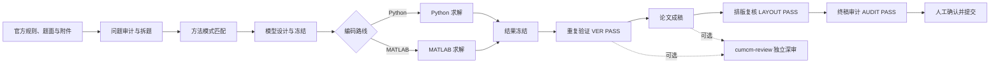

# 乱崎凶华 CUMCM Live Skills 

面向中国大学生数学建模竞赛（CUMCM）A、B、C 题的 Codex 技能套件。

本项目将赛时工作拆分为“题目审计 → 方法匹配 → 模型冻结 → 编码求解 → 结果复核 → 论文成稿 → 排版检查 → 提交审计”等阶段，并通过合同、运行清单、冻结编号和检查报告维持代码、数据、图表与论文之间的可追溯性。

> 本套件用于辅助生成建模底稿、代码、检查报告和论文草稿，不能替代参赛队员的独立判断。所有产物均须人工复核，并严格遵守当届竞赛规则及 AI 工具使用规定。

## 项目特点

- **阶段化工作流**：不同技能负责不同环节，可单独调用，也可按完整流程组合使用。
- **Baseline 优先**：先建立可运行、可解释、可验证的基础方案，再评估增强模型。
- **结果冻结与门禁**：模型未冻结不进入编码，结果未复核不进入论文，排版未通过不进入终审。
- **全过程可追溯**：利用 `contract_version`、`freeze_id`、`run_id`、`RID`、`FIG`、`TAB`、`CONTRIB` 等标识连接模型、结果、图表和文字。
- **双编码路线**：同时提供 Python 与 MATLAB 赛时实现规范、运行清单和失败回退方案。
- **安全与合规优先**：官方规则不清时阻断流程；题目附件一律视为不可信输入，不执行宏、安装器或未知二进制。
- **论文质量闭环**：覆盖数值追溯、独立复算、真实 PDF 逐页检查、匿名检查和提交包安全审计。

## 技能清单

| 技能目录 | 阶段 | 主要用途 | 示例触发语 |
| --- | --- | --- | --- |
| `cumcm-idea` | 前期构思 | 对完整题目逐句审计，形成全题建模思路与后续流程交接文档 | “调用 cumcm-idea 分析这道题” |
| `cumcm-live-problem-analyst` | ① 拆题 | 盘点规则、题面与附件，拆分小问、依赖和验收条件，生成问题合同 | “刚发题，先拆题并形成问题合同” |
| `cumcm-live-case-retriever` | ② 方法匹配 | 提取问题签名，匹配内置原创模式卡，推荐 baseline 与候选模型 | “判断题型并推荐 baseline” |
| `cumcm-live-model-designer` | ③ 模型设计 | 比较候选模型，定义变量、公式、约束、验证门和回退方案，冻结模型合同 | “设计方案并冻结模型” |
| `cumcm-live-python-coder` | ④ Python 编码 | 将冻结合同实现为可复现的 Python 代码、结果表和论文图 | “按冻结合同用 Python 实现” |
| `cumcm-live-matlab-coder` | ④ MATLAB 编码 | 完成工具箱预检、求解实现、结果冻结和兼容性降级 | “按冻结合同用 MATLAB 实现” |
| `cumcm-live-result-verifier` | ⑤ 结果复核 | 同环境复跑、独立重算、约束检查、边界测试和论文数字反向追踪 | “复核结果并给出 PASS/BLOCKED” |
| `cumcm-live-paper-writer` | ⑥ 论文成稿 | 将已通过复核的模型、结果、图表和引文整理为 Word/LaTeX 论文草稿 | “把冻结结果写成论文” |
| `cumcm-live-layout-verifier` | ⑦ 排版复核 | 自动预检并逐页查看真实 PDF，检查裁切、重叠、分页、字体和匿名信息 | “渲染 PDF 并检查排版” |
| `cumcm-live-final-auditor` | ⑧ 终稿审计 | 检查提交包完整性、安全性、数值与引用一致性、AI 记录和规则合规性 | “提交前做终稿审计” |
| `cumcm-review` | 独立深审 | 从评审人角度进行 9 维度论文审查，输出 P0/P1/P2 问题清单 | “调用 cumcm-review 审查论文” |

## 推荐工作流



核心门禁原则：

1. 当届规则或 AI 使用许可不明确时，输出 `BLOCKED_RULES`，不继续给出赛时模型或求解建议。
2. 问题合同与模型合同未冻结时，不进入正式编码。
3. 结果未获得同版本 `VER-* PASS` 时，不得作为论文中的正式实验结果。
4. PDF 未获得同版本 `LAYOUT-* PASS` 时，不进入最终提交审计。
5. 终审未通过时，不宣称提交包“可提交”。
6. 代码、数据、参数或论文候选文件发生变化后，相关冻结和检查结论必须重新生成。

## 安装

### 1. 克隆仓库

```bash
git clone https://github.com/luanqi-xionghua/LQXH-cumcm-live-skills.git
cd LQXH-cumcm-live-skills
```

也可以在 GitHub 页面选择 **Code → Download ZIP**，解压后继续下面的步骤。

### 2. 安装到 Codex 技能目录

Codex 的个人技能目录通常为：

- Windows：`C:\Users\<用户名>\.codex\skills\`
- macOS / Linux：`~/.codex/skills/`

Windows PowerShell 示例：

```powershell
$source = (Get-Location).Path
$target = Join-Path $env:USERPROFILE ".codex\skills"

Get-ChildItem -LiteralPath $source -Directory |
    Where-Object { Test-Path -LiteralPath (Join-Path $_.FullName "SKILL.md") } |
    ForEach-Object {
        Copy-Item -LiteralPath $_.FullName -Destination $target -Recurse -Force
    }
```

macOS / Linux 示例：

```bash
mkdir -p ~/.codex/skills
for dir in */; do
  if [ -f "${dir}SKILL.md" ]; then
    cp -R "$dir" ~/.codex/skills/
  fi
done
```

安装完成后，重启 Codex 或新建会话，使技能元数据重新加载。

### 3. 安装常用 Python 依赖

建议使用 Python 3.10 或更高版本：

```bash
python -m pip install numpy pandas scipy scikit-learn statsmodels matplotlib networkx openpyxl pymupdf pdfplumber pytest
```

根据题型和工作路线，还可以安装：

```bash
python -m pip install xgboost lightgbm pillow opencv-python cvxpy python-docx
```

可选外部环境：

- MATLAB R2020a+，以及题目所需的 Optimization、Statistics and Machine Learning、Econometrics 等工具箱；
- TeX Live 或 MiKTeX，需包含 `xelatex`、`latexmk` 和 `ctex`；
- Microsoft Word（Word 成稿路线）；
- Poppler（提供 `pdftoppm`、`pdfinfo`、`pdfimages`，用于增强 PDF 预检）。

## 快速开始

在 Codex 中上传或指定以下材料：

- 当届官方竞赛规则与 AI 工具使用规定；
- 完整题面；
- 原始附件、数据字典和结果模板；
- 已有代码、结果或论文（如从中间阶段开始）。

然后根据目标直接点名技能。例如：

```text
请调用 cumcm-live-problem-analyst，读取本届规则、A/B/C 三道题及全部附件，
先做附件清单和问题依赖分析，再给出选题建议与问题合同。
```

```text
请调用 cumcm-live-model-designer，根据已经确认的问题合同，
为每个小问设计 baseline、主模型、验证方案和失败回退，并冻结模型合同。
```

```text
请调用 cumcm-live-python-coder，严格按照冻结模型合同实现，
固定随机种子，记录运行环境，输出代码、结果表、论文图和 run-manifest。
```

```text
请调用 cumcm-review，对论文 PDF、源文件、代码、数据和冻结结果做独立审查，
按 P0/P1/P2 输出问题清单；本轮只读，不修改文件。
```

## 建议的比赛目录

```text
CUMCM2026/
├─ rules/          # 当届官方规则与 AI 使用规定
├─ problem/        # 官方题面与原始附件，只读保存
├─ contract/       # 问题合同、模型合同、贡献账本
├─ code/           # 冻结代码与运行清单
├─ results/        # JSON/CSV 等冻结结果
├─ figures/        # 论文图与图表登记表
├─ paper/          # Word/LaTeX 源文件与参考文献
├─ checks/         # VER、LAYOUT、AUDIT、review 报告
└─ submission/     # 最终候选提交包
```

建议保持 `problem/` 和 `rules/` 只读，不在原始材料目录内写入中间结果。

## 自带脚本

| 脚本 | 位置 | 用途 |
| --- | --- | --- |
| `build_problem_manifest.py` | `cumcm-live-problem-analyst/scripts/` | 生成题面及附件清单，可输出 Markdown 或 JSON |
| `compare_runs.py` | `cumcm-live-result-verifier/scripts/` | 比较两次运行的数值、结构和文件哈希 |
| `layout_preflight.py` | `cumcm-live-layout-verifier/scripts/` | 检查页数、占位符、编译错误、批注修订等排版问题 |
| `audit_submission.py` | `cumcm-live-final-auditor/scripts/` | 只读扫描提交包的完整性、安全风险和文件哈希 |
| `review_paper.py` | `cumcm-review/scripts/` | 提取 PDF 信息并执行论文机器预检 |
| `consistency_check.py` | `cumcm-review/scripts/` | 检查代码、数据、冻结结果与论文之间的一致性 |
| `smoke_test_review.py` | `cumcm-review/scripts/` | 对论文审查流程执行冒烟测试 |

运行仓库现有自动化测试：

```bash
python -m pytest -q \
  cumcm-live-result-verifier/tests \
  cumcm-live-layout-verifier/tests \
  cumcm-live-final-auditor/tests
```

脚本检查通过只代表相应机器规则通过，不等价于论文内容正确，也不等价于满足当届官方规则。

## 合规与安全

- **以当届官方文件为准**：仓库内的经验、模式卡和模板不构成本届事实或规则证据。
- **如实披露 AI 使用**：AI 参与代码、图表、翻译、润色或内容生成时，应按当届要求保存记录并进行声明。
- **不执行未知附件**：不要运行题目包、网盘资料或第三方材料中的 `.exe`、`.lnk`、Office 宏、安装脚本和未知二进制。
- **不猜测缺失信息**：附件、字段、单位、精度或结果模板缺失时，应记录阻断项，不得虚构补全。
- **人工承担最终责任**：模型选择、计算结果、论文表述、引文真实性和提交合规性均需参赛队员最终确认。
- **范围限制**：赛时主线技能明确面向 CUMCM A、B、C 题，不覆盖 D、E 题，也不应直接套用其他竞赛规则。

## 当前仓库状态说明

截至仓库 `main` 分支的当前版本：

- 根目录说明提到了名为 `cumcm-live` 的八阶段总控技能，但仓库中尚未包含对应的 `cumcm-live/` 目录；现阶段请直接调用各 `cumcm-live-*` 阶段技能。
- `visual-director/` 当前包含视觉设计文档与代理配置，但没有独立的 `SKILL.md` 入口，因此默认安装脚本不会把它当作可加载技能复制。
- 旧版说明中的 `<仓库>\skills\...` 路径与当前目录结构不一致；本仓库的技能目录直接位于仓库根目录下。

如后续版本已补齐上述目录，请以最新仓库文件树和各目录内的 `SKILL.md` 为准。

## 常见问题

### 可以一次性让 Codex 完成整场比赛吗？

不建议把所有工作压成一个不可检查的步骤。更可靠的方式是按阶段交付，每个阶段确认输入、产物和门禁状态，再进入下一阶段。

### Python 和 MATLAB 应该选哪个？

优先选择团队最熟悉、能够在截止前稳定复现的工具。Python 生态更灵活，MATLAB 在矩阵计算、优化工具箱和工程绘图方面更集中；复杂度不是选型的首要标准。

### `VER-* PASS` 是否代表结果一定正确？

不是。它表示同一冻结版本完成了规定的复跑、独立复核和约束检查。若输入、代码、参数或环境发生变化，需要重新冻结和验证。

### `cumcm-review` 与 `cumcm-live-final-auditor` 有什么区别？

`cumcm-review` 关注论文质量和可改进问题；`cumcm-live-final-auditor` 关注提交包是否完整、安全、可追溯，并是否满足已取得的当届规则。前者回答“论文哪里需要改”，后者回答“当前候选包是否具备提交条件”。

## 许可证

本项目采用 [MIT License](LICENSE)。

## 免责声明

本项目按“现状”提供，不保证获奖、评审结果或提交成功。使用者应自行确认软件依赖、计算结果、引用来源、数据授权及竞赛合规性。

---

项目地址：<https://github.com/luanqi-xionghua/LQXH-cumcm-live-skills>
